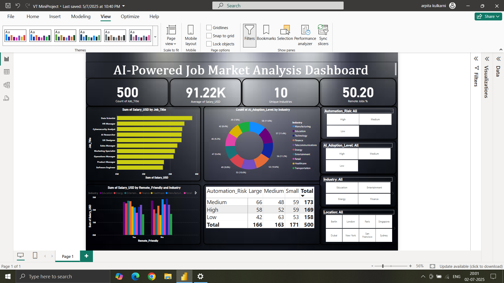

# AI-Powered Job Market Analysis Dashboard

A sleek Power BI dashboard analyzing trends in the AI job market.

## 🔍 Features
- Visualizes salaries across job titles
- Shows AI adoption levels by industry
- Highlights automation risk
- Remote job friendliness
- Filters by industry, AI level, and location

## 📊 Tools Used
- Power BI
- Excel for data prep

## 📷 Preview

## 📁 Files
- `dashboard.png` - Dashboard image
- `AI_Job_Dashboard.pbix` - (optional Power BI file)

---

Created by: Vaishnavi Ghuge 🎓  
MIT Aurangabad | BTech - AI & Data Science  
